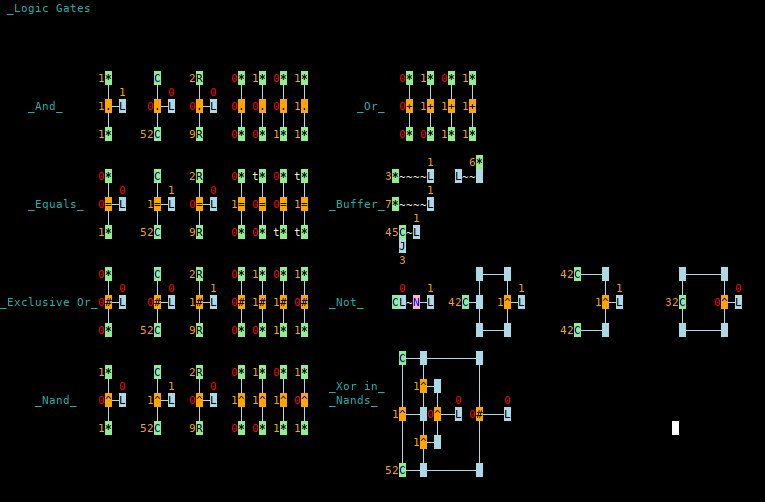
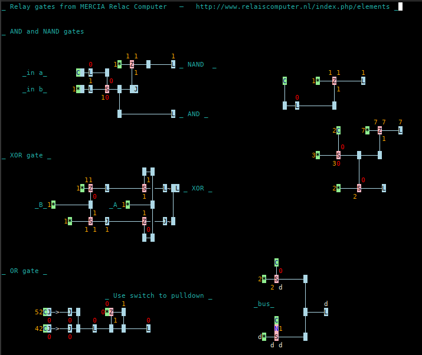
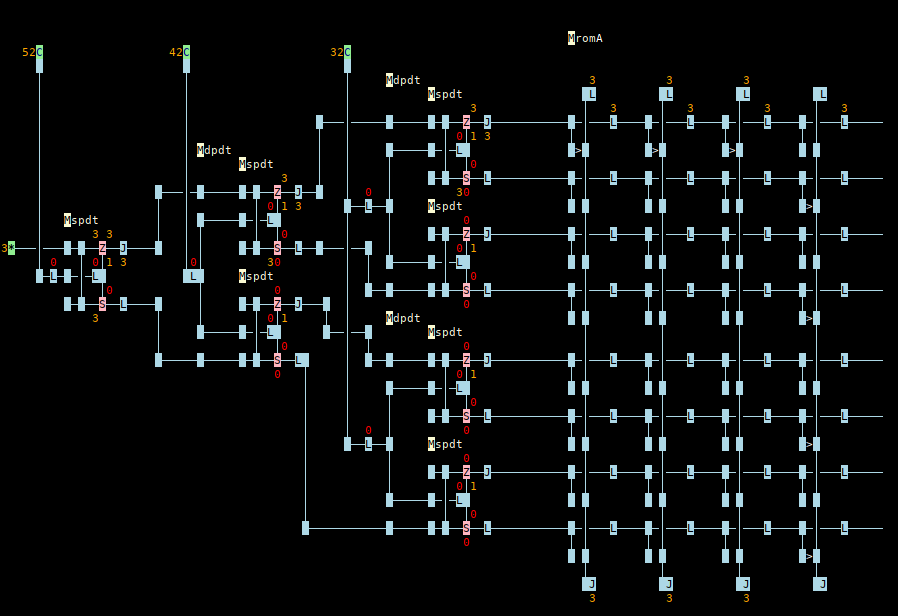

# betula
A live-coding logic simulation with a text user interface

```shell
go build -gcflags="all=-N -l" && ./betula clock.betula ; stty sane ; tset
```

Screencast videos here: [](https://asciinema.org/a/hKXqGpfb85gnNFby96F1uPZhK) and here: [](https://asciinema.org/a/439857)

# Cell Value types

```text
#
*
+
-
.
/
<
=
>
@
B
C
D
E
J
L
M
N
R
S
Z
\\
^
_
|
~
```
# Special Keystrokes
- * add a value flag and move left
- add a horizontal line and move right
- BACKSPACE Delete the cell to the left of the cursor
- CTRL-C Copy the selected region to a buffer
- CTRL-Q Quit, no save
- CTRL-S, Save file
- CTRL-V Paste the buffer at cursor position
- CTRL-X Cut the selected region to the buffer
- DEL Delete selection or cell at cursor position
- F4 Save to file
- F5 Cycle to the next value at the cursor
- UP, DOWN, LEFT and RIGHT arrow keys move the cursor
- | add a vertical line and move down

Other keys add a value to the cell at the cursor.

# Screenshots

Logic  Gates



Relay Circuits



Wolffia Relay Computer



# Development

Build for IDE attach to process debugger

```bash
go build -gcflags="all=-N -l"
```
